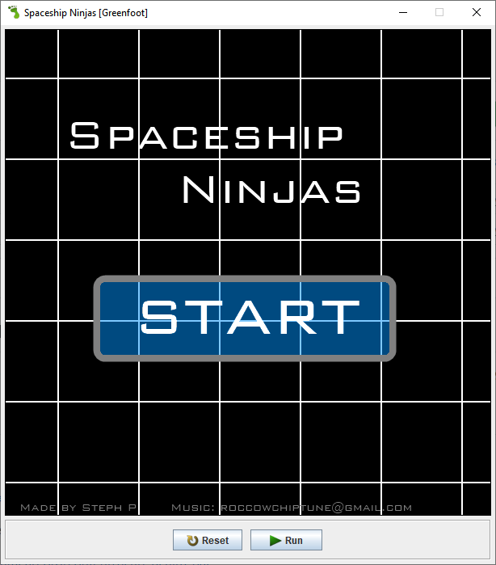
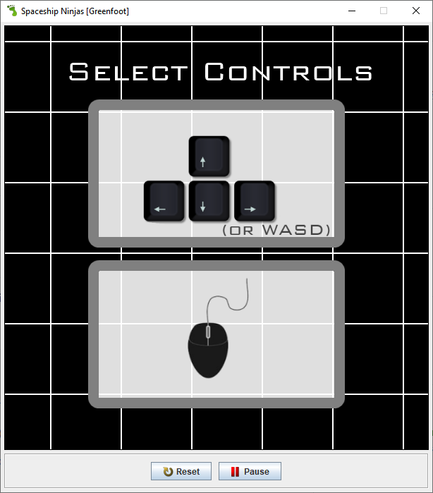
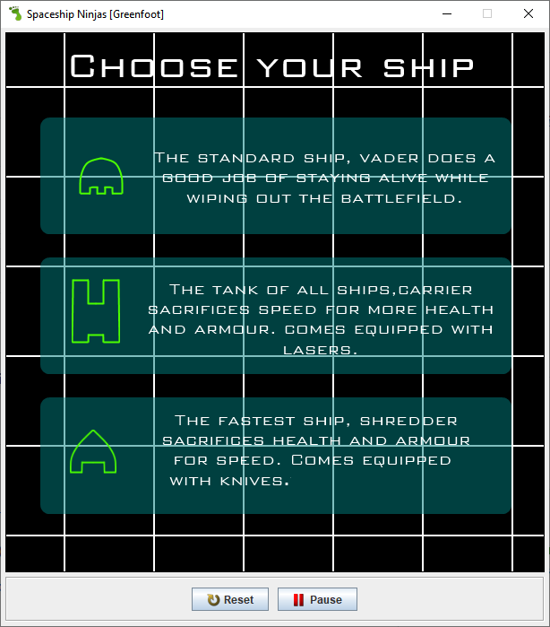
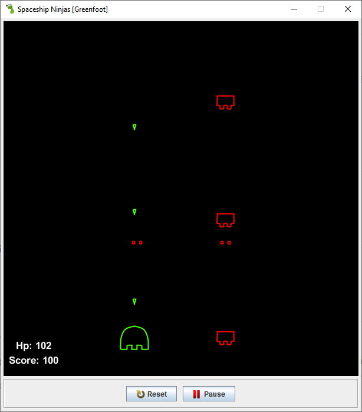
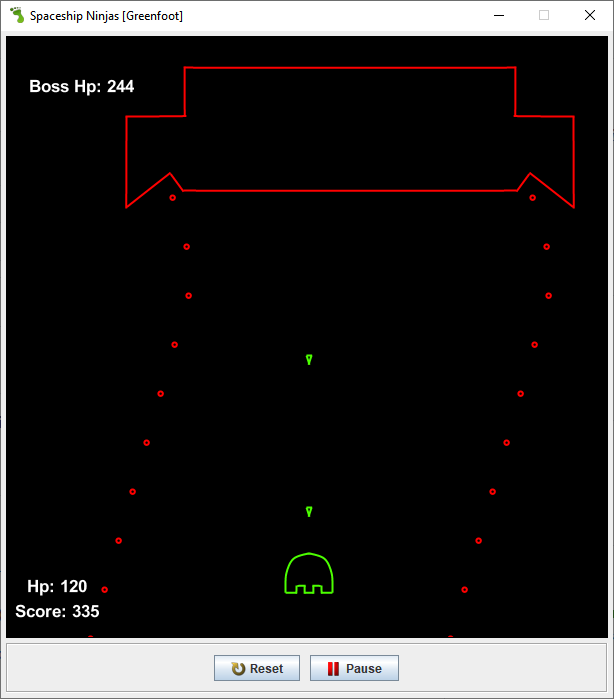
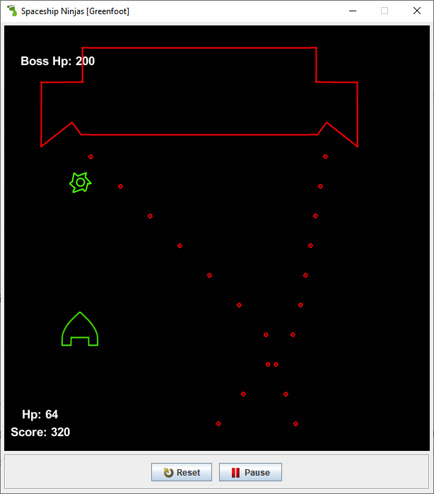

# spaceship_ninjas
My first programming project! (that was created from nothing!)

Created early June 2014, I created this entire game by scratch. The only thing that doesn't belong to me is the music, which was created open source by RoccoW (roccowchiptune@gmail.com), and a few support classes for audio and timing. Here is nearly the exact same copy of what I did three years ago, with an added easter egg.

The reason I'm uploading this now is just to see how far I've come. Perhaps in the future, I'll remake this project. I hope you like it!

.Steph

## Features: 

- Mouse or keyboard control
- 3 different ships
- 5 unique bosses
- a variety of enemy ships

